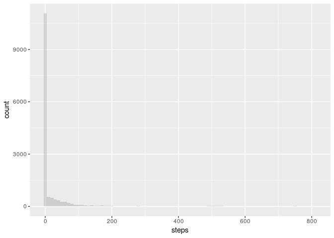
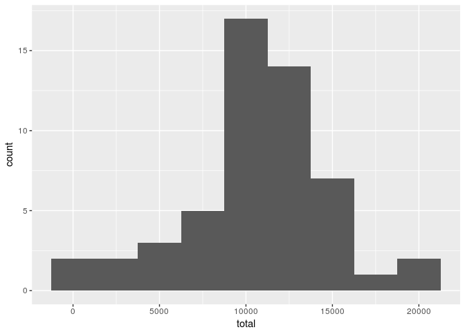
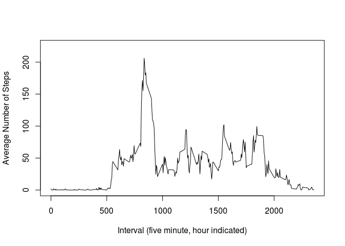
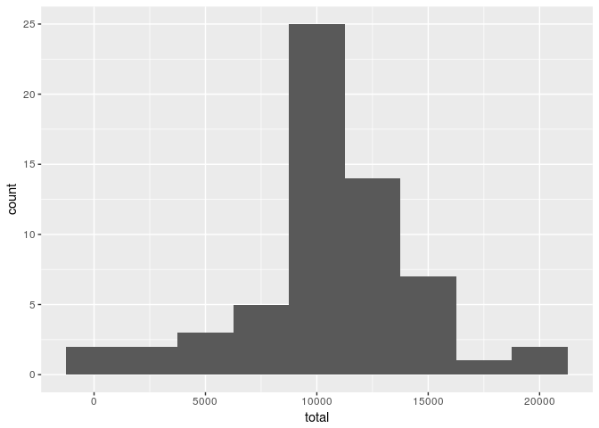
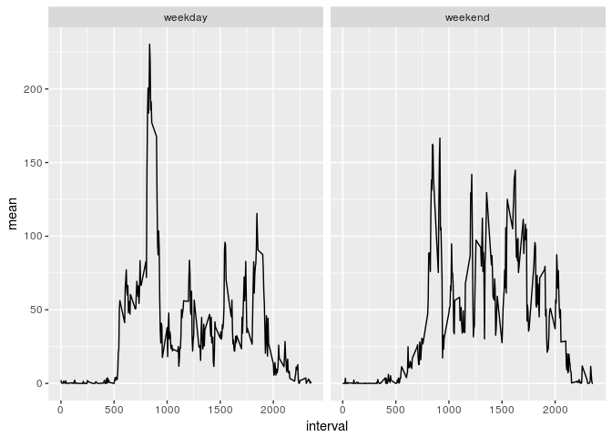

## Loading and preprocessing the data


This is a project to demonstrate Reproducible Research with the *activity* dataset:

1. Load the data


```r
unzip("activity.zip", "activity.csv")
d <- read.csv("activity.csv")
```

2.  Process/transform the data


```r
d %>% 
  mutate(date=as.Date(date)) %>%
  group_by(date) %>%
  filter(is.na(steps)!=TRUE ) -> D
```


## What is mean total number of steps taken per day?

1. Make a histogram of the total number of steps taken each day

The histogram(s) below show that the distributions are dominated by zero, or otherwise are concentrated near zero.


```r
D %>% 
  ggplot(aes(steps)) -> g

g + 
  geom_histogram( aes(x=steps, fill=date), 
                  alpha=0.2, 
                  position="identity",
                  binwidth=10 ) 
```

<!-- -->


2. Calculate and report the **mean** and **median** total number of steps taken per day

The mean steps per day is 37.4. However, the median steps per day is zero:


```r
D %>%
  summarize(mean=mean(steps),
            median=median(steps)) %>%
  summarize(mn=mean(mean), 
            md = median(median)) %>%
  print()
```

```
## # A tibble: 1 x 2
##      mn    md
##   <dbl> <dbl>
## 1  37.4    0.
```


## Total number of *steps*

The total number of steps taken was over 570000. 


```r
D %>%
  summarise(total=sum(steps), 
            n=n()) -> total

(sum(total$total))
```

```
## [1] 570608
```

The total number of steps taken per day varied from 0 to a little over 20000, with the main concentration near 10000, as shown by the following histogram.


```r
total %>% 
  ggplot(aes(total)) -> g

g + 
  geom_histogram( aes(x=total), 
                  binwidth=2500 ) 
```

<!-- -->


## What is the average daily activity pattern?


```r
d %>% 
  mutate(date=as.Date(date)) %>%
  group_by(interval) %>%
  filter(is.na(steps)!=TRUE ) -> E
```

1. Make a time series plot (i.e. `type = "l"`) of the 5-minute interval (x-axis) and the average number of steps taken, averaged across all days (y-axis)

See plot below.

2. Which 5-minute interval, on average across all the days in the dataset, contains the maximum number of steps?

The average daily activity pattern shows most steps concentrated between interval 5:00 and 20:00, with a larger peak of 206 steps centered at 8:35.


```r
E %>%
  summarize(mean=mean(steps),
            median=median(steps)) -> mnsteps

mnsteps %>%
  summarize(mn=mean(mean), 
            md = median(median)) %>%
  print()
```

```
## # A tibble: 1 x 2
##      mn    md
##   <dbl> <dbl>
## 1  37.4    0.
```

```r
plot(mnsteps$interval, 
     mnsteps$mean, 
     type="l", 
     ylim=c(0,225),
     xlab="Interval (five minute, hour indicated)",
     ylab="Average Number of Steps",
     main=" ")
```

<!-- -->

```r
mnsteps %>%
  filter(mean == max(mean)) %>%
  print()
```

```
## # A tibble: 1 x 3
##   interval  mean median
##      <int> <dbl>  <int>
## 1      835  206.     19
```


## Imputing missing values

1. Calculate and report the total number of missing values in the dataset (i.e. the total number of rows with `NA`s)

There were 2304 missing values (coded as "NA"), or about 13%:


```r
d %>%
  summarise(NA_n=sum(is.na(steps)), 
            total_n=n(), 
            prop_NA=NA_n/n()) -> NAs

print(NAs)
```

```
##   NA_n total_n   prop_NA
## 1 2304   17568 0.1311475
```

Filling in missing values

2. Devise a strategy for filling in all of the missing values in the dataset. The strategy does not need to be sophisticated. For example, you could use the mean/median for that day, or the mean for that 5-minute interval, etc.


First we will group by date and rebuild our data table with the missing values still remaining, and also identify which dates contain the NAs:


```r
d %>% 
    mutate(date=as.Date(date)) %>%
    group_by(date) -> D

table(d$date, is.na(d$steps))
```

```
##             
##              FALSE TRUE
##   2012-10-01     0  288
##   2012-10-02   288    0
##   2012-10-03   288    0
##   2012-10-04   288    0
##   2012-10-05   288    0
##   2012-10-06   288    0
##   2012-10-07   288    0
##   2012-10-08     0  288
##   2012-10-09   288    0
##   2012-10-10   288    0
##   2012-10-11   288    0
##   2012-10-12   288    0
##   2012-10-13   288    0
##   2012-10-14   288    0
##   2012-10-15   288    0
##   2012-10-16   288    0
##   2012-10-17   288    0
##   2012-10-18   288    0
##   2012-10-19   288    0
##   2012-10-20   288    0
##   2012-10-21   288    0
##   2012-10-22   288    0
##   2012-10-23   288    0
##   2012-10-24   288    0
##   2012-10-25   288    0
##   2012-10-26   288    0
##   2012-10-27   288    0
##   2012-10-28   288    0
##   2012-10-29   288    0
##   2012-10-30   288    0
##   2012-10-31   288    0
##   2012-11-01     0  288
##   2012-11-02   288    0
##   2012-11-03   288    0
##   2012-11-04     0  288
##   2012-11-05   288    0
##   2012-11-06   288    0
##   2012-11-07   288    0
##   2012-11-08   288    0
##   2012-11-09     0  288
##   2012-11-10     0  288
##   2012-11-11   288    0
##   2012-11-12   288    0
##   2012-11-13   288    0
##   2012-11-14     0  288
##   2012-11-15   288    0
##   2012-11-16   288    0
##   2012-11-17   288    0
##   2012-11-18   288    0
##   2012-11-19   288    0
##   2012-11-20   288    0
##   2012-11-21   288    0
##   2012-11-22   288    0
##   2012-11-23   288    0
##   2012-11-24   288    0
##   2012-11-25   288    0
##   2012-11-26   288    0
##   2012-11-27   288    0
##   2012-11-28   288    0
##   2012-11-29   288    0
##   2012-11-30     0  288
```


3. Create a new dataset that is equal to the original dataset but with the missing data filled in.

Then we replace the missing values with the mean of the other days (from mnsteps grouped by interval; calculated above).


```r
D[D$date=="2012-10-01",]$steps <- mnsteps$mean
D[D$date=="2012-10-08",]$steps <- mnsteps$mean
D[D$date=="2012-11-01",]$steps <- mnsteps$mean
D[D$date=="2012-11-04",]$steps <- mnsteps$mean
D[D$date=="2012-11-09",]$steps <- mnsteps$mean
D[D$date=="2012-11-10",]$steps <- mnsteps$mean
D[D$date=="2012-11-14",]$steps <- mnsteps$mean
D[D$date=="2012-11-30",]$steps <- mnsteps$mean
```

And confirm that the replacement succeeded:


```r
table(D$date, is.na(D$steps))
```

```
##             
##              FALSE
##   2012-10-01   288
##   2012-10-02   288
##   2012-10-03   288
##   2012-10-04   288
##   2012-10-05   288
##   2012-10-06   288
##   2012-10-07   288
##   2012-10-08   288
##   2012-10-09   288
##   2012-10-10   288
##   2012-10-11   288
##   2012-10-12   288
##   2012-10-13   288
##   2012-10-14   288
##   2012-10-15   288
##   2012-10-16   288
##   2012-10-17   288
##   2012-10-18   288
##   2012-10-19   288
##   2012-10-20   288
##   2012-10-21   288
##   2012-10-22   288
##   2012-10-23   288
##   2012-10-24   288
##   2012-10-25   288
##   2012-10-26   288
##   2012-10-27   288
##   2012-10-28   288
##   2012-10-29   288
##   2012-10-30   288
##   2012-10-31   288
##   2012-11-01   288
##   2012-11-02   288
##   2012-11-03   288
##   2012-11-04   288
##   2012-11-05   288
##   2012-11-06   288
##   2012-11-07   288
##   2012-11-08   288
##   2012-11-09   288
##   2012-11-10   288
##   2012-11-11   288
##   2012-11-12   288
##   2012-11-13   288
##   2012-11-14   288
##   2012-11-15   288
##   2012-11-16   288
##   2012-11-17   288
##   2012-11-18   288
##   2012-11-19   288
##   2012-11-20   288
##   2012-11-21   288
##   2012-11-22   288
##   2012-11-23   288
##   2012-11-24   288
##   2012-11-25   288
##   2012-11-26   288
##   2012-11-27   288
##   2012-11-28   288
##   2012-11-29   288
##   2012-11-30   288
```


Total number of *steps*

4. Make a histogram of the total number of steps taken each day and Calculate and report the **mean** and **median** total number of steps taken per day. Do these values differ from the estimates from the first part of the assignment? What is the impact of imputing missing data on the estimates of the total daily number of steps?


With the revised data table, the *total* number of steps taken was well over 650000. 


```r
D %>%
  summarise(total=sum(steps), 
            n=n()) -> total

(sum(total$total))
```

```
## [1] 656737.5
```

Variation in total steps, revised with estimated missing values.

As before, the total number of steps taken per day varied from 0 to a little over 20000, with the main concentration near 10000, as shown by the this histogram of the revised data table:


```r
total %>% 
  ggplot(aes(total)) -> g

g + 
  geom_histogram( aes(x=total), 
                  binwidth=2500 ) 
```

<!-- -->

Average steps, revised with estimated missing values.

The mean number of steps per day is 37.4, and the median is 0.  This is the same as the analysis in which the missing data were removed -- so there was no impact of replacing the missing values for the total number of steps.  


```r
D %>%
  summarize(mean=mean(steps),
            median=median(steps))  %>%
  summarize(mn=mean(mean), 
            md = median(median))
```

```
## # A tibble: 1 x 2
##      mn    md
##   <dbl> <dbl>
## 1  37.4    0.
```


## Are there differences in activity patterns between weekdays and weekends?

Setup

```r
if(!is.Date(D$date)){ print("Reformat date.")}
Sys.setlocale("LC_TIME", "en_US.UTF-8")
```

```
## [1] "en_US.UTF-8"
```

1. Create a new factor variable in the dataset with two levels -- "weekday" and "weekend" indicating whether a given date is a weekday or weekend day.

Identify weekdays and weekends.

```r
D %>%
  mutate(
    weekday = case_when(
                weekdays(date) == "Saturday" | 
                weekdays(date) == "Sunday" ~ "weekend",
                TRUE                       ~ "weekday" 
              ) 
        ) -> D
        
  D$weekday <- as.factor(D$weekday)
```


Confirm assignment.

```r
table(D$weekday, weekdays(D$date))
```

```
##          
##           Friday Monday Saturday Sunday Thursday Tuesday Wednesday
##   weekday   2592   2592        0      0     2592    2592      2592
##   weekend      0      0     2304   2304        0       0         0
```

1. Make a panel plot containing a time series plot (i.e. `type = "l"`) of the 5-minute interval (x-axis) and the average number of steps taken, averaged across all weekday days or weekend days (y-axis). 


```r
D %>%
  group_by(weekday, interval) %>%
  summarize(mean=mean(steps), 
            median=median(steps)) -> mnsteps
```

The activity profiles differ comparing weekdays versus the weekend.  The peak in the morning between (roughly) 8:00 and 10:00 is reduced on the weekends, and there are more steps in the mid-day period on the weekends.
  
Comparison of weekday versus weekend.

```r
mnsteps %>% 
  ggplot(aes(x=interval, y=mean)) -> g
      
g + 
  geom_line( aes(interval, mean)) +
  facet_wrap(~weekday, ncol=2) 
```

<!-- -->

